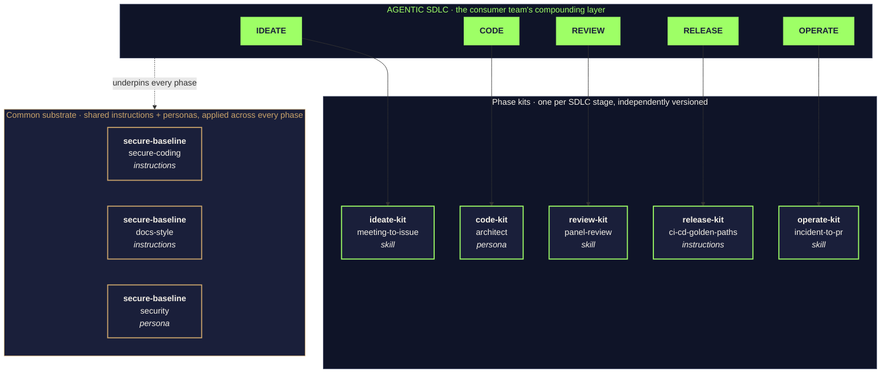

# zava-agent-config

**Central agent configuration marketplace for Zava Engineering.** Every Zava service repo (storefront, checkout, platform, …) pins one or more plugins from this package via `apm.yml`, so a single change here propagates to every developer's IDE, every PR, and every Coding Agent run across the org.

> Part of the joint Microsoft + GitHub Agentic SDLC Demo Platform. See [`PLATFORM.md`](https://github.com/DevExpGbb/agentic-sdlc-ref/blob/main/PLATFORM.md) for the full reference and [`delivery/lloyds-ph1-delivery-plan.md`](https://github.com/DevExpGbb/agentic-sdlc-ref/blob/main/delivery/lloyds-ph1-delivery-plan.md) for the customer-facing workshop slice.

## How the kits compose



> *Modular packages. Composable agent behaviour.* — One kit per SDLC phase, plus a common substrate of shared instructions and personas (today: `secure-baseline`; tomorrow: more). Each kit is independently versioned, pinned by consumers in `apm.yml`, audited every PR, and distributed as signed tarballs (see [Governance](#governance)).

## What's in here (v5.0.1)

A 6-plugin APM marketplace aligned to the [PLATFORM.md §6.1](https://github.com/DevExpGbb/agentic-sdlc-ref/blob/main/PLATFORM.md#61-layer-a--the-sdlc-ribbon) SDLC ribbon:

| Plugin | SDLC stage | Source |
|---|---|---|
| [`secure-baseline`](plugins/secure-baseline/) | cross-cutting | secure-coding + docs-style instructions; security persona |
| [`ideate-kit`](plugins/ideate-kit/) | IDEATE | `meeting-to-issue` skill |
| [`code-kit`](plugins/code-kit/) | CODE | architect persona (design-intent guidance during authoring) |
| [`review-kit`](plugins/review-kit/) | REVIEW | `panel-review` skill (pre-PR self-review by author) |
| [`release-kit`](plugins/release-kit/) | RELEASE | `ci-cd-golden-paths` instructions |
| [`operate-kit`](plugins/operate-kit/) | OPERATE | `incident-to-pr` skill |

See [`CATALOG.md`](CATALOG.md) for the full index, migration table from v1.0.x, and consumer pin recipes.

## How a Zava service repo consumes this

```yaml
# zava-storefront/apm.yml — pick only the kits you need
dependencies:
  apm:
    - DevExpGbb/zava-agent-config/plugins/secure-baseline#v5.0.1
    - DevExpGbb/zava-agent-config/plugins/code-kit#v5.0.1
    - DevExpGbb/zava-agent-config/plugins/review-kit#v5.0.1
    - DevExpGbb/zava-agent-config/plugins/release-kit#v5.0.1
```

After `apm install`, the service inherits the selected plugins' skills, instructions, and personas. Layered service-local instructions in the consumer's `.apm/` always win over inherited ones.

## Governance

Org-wide policy lives at [`DevExpGbb/.github/apm-policy.yml`](https://github.com/DevExpGbb/.github/blob/main/apm-policy.yml) and is automatically inherited by every repo. CI gates (`apm audit --ci`) run on every PR via the reusable workflow at [`.github/workflows/apm-audit.yml`](.github/workflows/apm-audit.yml). A GHE org-level ruleset (configured on `zava-engineering`) makes the green check **required for merge**.

This repo eats its own dog food via [`.github/workflows/self-audit.yml`](.github/workflows/self-audit.yml): every push runs `apm install` + `apm audit --ci` + `apm pack` against the marketplace and fails the build on drift.

## Local dev

```bash
git clone https://github.com/DevExpGbb/zava-agent-config.git
cd zava-agent-config
apm install                  # no-op (marketplace repo, zero deps), catches CLI regressions
apm audit --ci               # org-policy + supply-chain checks
apm pack --offline           # rebuild .claude-plugin/marketplace.json (commit any diff)
```
