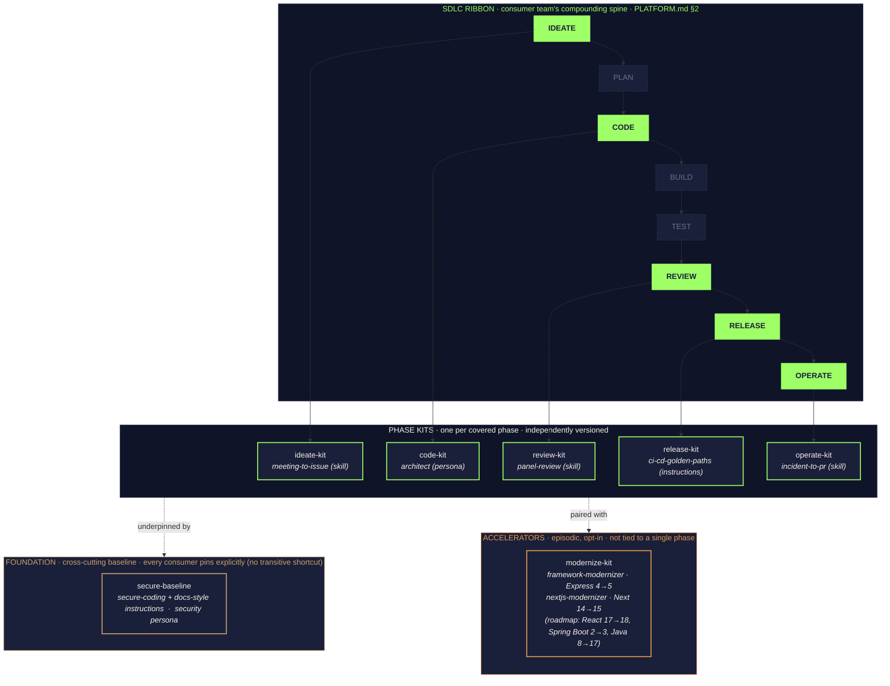

# zava-agent-config

> **Part of the [Zava Workshop Kit](https://github.com/DevExpGbb/zava-workshop-kit)** — this is the marketplace of Agent Skills + APM kits used by the workshop bundle. To deploy the full bundle into your org, start at the kit.

**Central agent configuration marketplace for Zava Engineering.** Every Zava service repo (storefront, checkout, platform, …) pins one or more plugins from this package via `apm.yml`, so a single change here propagates to every developer's IDE, every PR, and every Coding Agent run across the org.

> Part of the joint Microsoft + GitHub Agentic SDLC Demo Platform. See [`PLATFORM.md`](https://github.com/DevExpGbb/agentic-sdlc-ref/blob/main/PLATFORM.md) for the full reference and [`delivery/lloyds-ph1-delivery-plan.md`](https://github.com/DevExpGbb/agentic-sdlc-ref/blob/main/delivery/lloyds-ph1-delivery-plan.md) for the customer-facing workshop slice.

## How the kits compose

The marketplace is a 3-tier taxonomy that mirrors the [PLATFORM.md SDLC ribbon](https://github.com/DevExpGbb/agentic-sdlc-ref/blob/main/PLATFORM.md#2-the-agentic-sdlc-ribbon). **Phase kits** compound in lockstep with developer flow (one per phase). The **cross-cutting baseline** is a foundation underlay every consumer pins explicitly. **Accelerators** are episodic, opt-in plugins that don't map to a single phase (framework migrations, large refactors).



**Reading the diagram.** Solid green phases have a kit shipping today; dashed phases (`PLAN`, `BUILD`, `TEST`) are roadmap — kits land additively as content matures, no breaking re-pins for consumers. The foundation (`secure-baseline`) sits *under* the phase kits because it is a security floor, not a phase tool — every consumer declares it explicitly so a `grep secure-baseline apm.yml` proves the floor is in force. Accelerators sit *beside* the phase row because their value is bursty (you run them once per migration), unlike phase kits which compound on every PR.

> *Modular packages. Composable agent behaviour.* — Each plugin is independently versioned, pinned by consumers in `apm.yml`, audited every PR, and distributed as signed tarballs (see [Governance](#governance)). Two accelerators ship today: `framework-modernizer` (Express 4→5, **v6.0.0**) and `nextjs-modernizer` (Next 14→15, **v6.1.0**).

## What's in here (v6.0.0)

A 7-plugin APM marketplace aligned to the [PLATFORM.md §6.1](https://github.com/DevExpGbb/agentic-sdlc-ref/blob/main/PLATFORM.md#61-layer-a--the-sdlc-ribbon) SDLC ribbon. Three categories per the taxonomy above:

**Foundation (cross-cutting)**
| Plugin | What's inside |
|---|---|
| [`secure-baseline`](plugins/secure-baseline/) | secure-coding + docs-style instructions; security persona. Every consumer pins this explicitly — see [Consumption patterns](CATALOG.md#consumption-patterns). |

**Phase kits (one per covered SDLC phase)**
| Plugin | SDLC phase | Source |
|---|---|---|
| [`ideate-kit`](plugins/ideate-kit/) | IDEATE | `meeting-to-issue` skill |
| [`code-kit`](plugins/code-kit/) | CODE | architect persona (design-intent guidance during authoring) |
| [`review-kit`](plugins/review-kit/) | REVIEW | `panel-review` skill (pre-PR self-review by author) |
| [`release-kit`](plugins/release-kit/) | RELEASE | `ci-cd-golden-paths` instructions |
| [`operate-kit`](plugins/operate-kit/) | OPERATE | `incident-to-pr` skill |

**Accelerators (episodic, opt-in — pin only when running a migration)**
| Plugin | What's inside | Roadmap |
|---|---|---|
| [`modernize-kit`](plugins/modernize-kit/) | `framework-modernizer` skill (Express 4→5) + `nextjs-modernizer` skill (Next 14→15): each ships a catalog of breaking-change patterns, SAFE/AUTOFIX/MANUAL classifier rubric, eval fixture, phased-plan template | `react-modernizer` (17→18), `springboot-modernizer` (2→3), `java-modernizer` (8→17) |

See [`CATALOG.md`](CATALOG.md) for the full index, migration table from v1.0.x, [consumption patterns](CATALOG.md#consumption-patterns), and consumer pin recipes.

## How a Zava service repo consumes this

```yaml
# zava-storefront/apm.yml — pick only the kits you need
dependencies:
  apm:
    - DevExpGbb/zava-agent-config/plugins/secure-baseline#v5.0.1
    - DevExpGbb/zava-agent-config/plugins/code-kit#v5.0.1
    - DevExpGbb/zava-agent-config/plugins/review-kit#v5.0.1
    - DevExpGbb/zava-agent-config/plugins/release-kit#v5.0.1
```

After `apm install`, the service inherits the selected plugins' skills, instructions, and personas. Layered service-local instructions in the consumer's `.apm/` always win over inherited ones.

## Governance

Org-wide policy lives at [`DevExpGbb/.github/apm-policy.yml`](https://github.com/DevExpGbb/.github/blob/main/apm-policy.yml) and is automatically inherited by every repo. CI gates (`apm audit --ci`) run on every PR via the reusable workflow at [`.github/workflows/apm-audit.yml`](.github/workflows/apm-audit.yml). A GHE org-level ruleset (configured on `zava-engineering`) makes the green check **required for merge**.

This repo eats its own dog food via [`.github/workflows/self-audit.yml`](.github/workflows/self-audit.yml): every push runs `apm install` + `apm audit --ci` + `apm pack` against the marketplace and fails the build on drift.

## Local dev

```bash
git clone https://github.com/DevExpGbb/zava-agent-config.git
cd zava-agent-config
apm install                  # no-op (marketplace repo, zero deps), catches CLI regressions
apm audit --ci               # org-policy + supply-chain checks
apm pack --offline           # rebuild .claude-plugin/marketplace.json (commit any diff)
```
