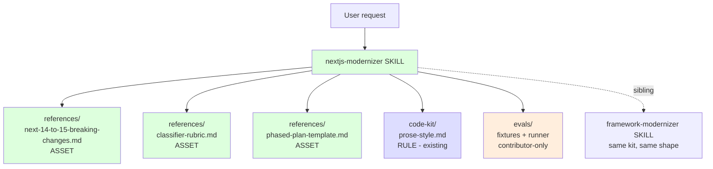
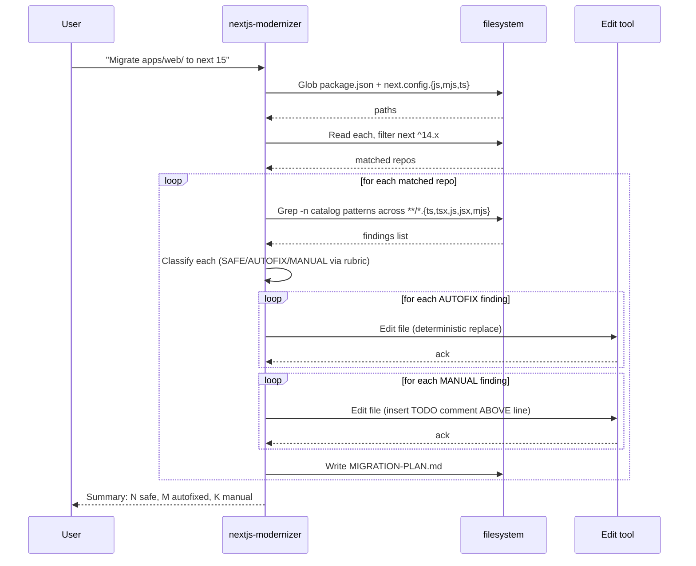

# Genesis design handoff packet — nextjs-modernizer

> Output of the [Genesis](https://github.com/DevExpGbb/genesis) 8-step design discipline. Persisted here so reviewers (and trainees adapting this pattern to other framework migrations) can reproduce the reasoning.

This skill is the **second** member of `modernize-kit`. The first (`framework-modernizer`, Express 4 → 5) established the shape; this skill applies it verbatim to a Next.js 14 → 15 migration. Where the architecture is identical, this packet says so and links to the original; where Next.js-specific decisions land, they are spelled out.

## Step 1 — intent + scope

**Capability:** Audit a Next.js codebase for Next 14 → 15 breaking changes, classify each finding, apply safe autofixes, and emit a phased migration plan grounded in the official Next.js 15 upgrade guide.

**Single Responsibility check:** "audit AND fix AND plan" is one capability — *prepare a Next.js codebase for a major-version upgrade*. Same logic as `framework-modernizer/references/DESIGN.md` step 1. PASS.

**Boundary (what it does NOT do):**
- Does not bump `next` or `react` in `package.json` (deliberate human gate — bumping invalidates the lockfile and triggers `npm install`).
- Does not run `npm test` or `next build` (the team's CI is the oracle).
- Does not handle other frameworks (one framework pair per skill — see `framework-modernizer` for the Express variant).
- Does not auto-run `@next/codemod` from inside the skill — it surfaces the codemod as a recommendation, the team runs it under review.

**Dispatch description (frontmatter `description`):** Imperative ("Use this skill when…"), names indirect triggers ("bump next to 15", "next 15 upgrade", "react 19", "async cookies error", "fetch no longer cached", "stuck on next 14"), declares boundary ("does NOT run consumer's tests; does NOT bump package.json"). Mode: BOTH (forced when explicitly invoked, discovery when `next` is on `^14.x` in a `package.json` being discussed).

## Step 2 — component diagram

## Step 3 — sequence diagram

Identical PIPELINE to `framework-modernizer` — `discover → scan → classify → autofix → emit plan`. Reproduced here so this packet stands alone:

**Pattern selection (genesis tier order):**

1. **Refactor patterns:** None apply yet. **Future R3 EXTRACT trigger:** when a 3rd modernizer skill (e.g. `react-modernizer`) lands, the shared body across `framework-modernizer` + `nextjs-modernizer` + new sibling is the rule-of-three signal to extract a `migration-engine.md` reference. Today that's TWO siblings — one short of rule-of-three. Hold the extraction.
2. **TIER 3 architectural pattern:** **PIPELINE** (genesis A2). Same as `framework-modernizer`. Anti-patterns inherited verbatim.
3. **TIER 2 design patterns:** **B4 PLAN MEMENTO** (`MIGRATION-PLAN.md` is the persisted plan), **B8 ATTENTION ANCHOR** (catalog file is THE source of truth — every finding must cite a `BC-NNN` from `next-14-to-15-breaking-changes.md`).
4. **TIER 1 idioms:** Loaded only at codegen — not relevant in design.

**Why not PANEL?** No independent lenses. Classification is mechanical (rubric is deterministic).

**Why deliberate parallelism with `framework-modernizer`?** Trainees who fork either skill (Track 4b in the workshop) calibrate against a **target shape**. Two skills with identical 5-step body, identical rubric, identical eval harness make the shape obvious. When a 3rd ships and the shared body is unambiguous, R3 EXTRACT replaces the duplication.

## Step 3.1 — tradeoff check

No alternatives in tension. Step 3 produced an unambiguous PIPELINE selection (same shape as the sibling skill, same justification). Skip.

## Step 3.5 — composition decision

| Box | Mode | Rationale |
|---|---|---|
| catalog (`next-14-to-15-breaking-changes.md`) | INLINE asset | Skill-specific. Next 15 patterns don't transfer to React or Spring Boot. |
| rubric (`classifier-rubric.md`) | INLINE asset (copied from `framework-modernizer`) | The 3-class taxonomy is identical to the sibling skill. **Copy, don't symlink** — when the 3rd modernizer skill ships, the shared rubric becomes the trigger for R3 EXTRACT into `references/migration-rubric.md` shared at the kit level. Until then, parallel copies make the shape visible. |
| plan template (`phased-plan-template.md`) | INLINE asset (copied from `framework-modernizer`) | Same logic. Identical structure; will share when 3rd sibling ships. |
| prose-style | EXTERNAL (already pinned via `code-kit`) | Cross-cutting style rules; shared across all repo skills. |
| evals fixture + runner | LOCAL SIBLING but **OUTSIDE** distribution boundary | Eval scenarios are maintainer-scope. Lives under `.apm/skills/nextjs-modernizer/evals/`; `apm pack` excludes by convention. |

**No external modules required** → no module-system adapter loaded at codegen (step 7b).

## Step 4 — SoC pass

| Existing module | Overlap? |
|---|---|
| `framework-modernizer` (Express 4 → 5) | **Sibling, not overlap.** Both are PIPELINE shape with same 5-step body, but they target different framework pairs. Dispatch descriptions are disjoint (Express triggers vs. Next.js triggers). |
| `code-kit` (style + lint instructions) | No — task-specific, not style. |
| `review-kit` (PR review) | No — review-kit reviews diffs after the fact; this skill prepares the diff. |
| `secure-baseline` (secret hooks) | No — orthogonal. |

**Dispatch collision check:** `framework-modernizer` description names "express", "express 5", "express 4"; `nextjs-modernizer` names "next", "next 15", "next 14", "react 19". Zero token overlap on the framework nouns. **No collision.**

**Verdict:** Net new capability with deliberate sibling shape. No SoC violation.

## Step 5 — PROSE compliance check

PROSE = **P**rogressive Disclosure / **R**educed Scope / **O**rchestrated Composition / **S**afety Boundaries / **E**xplicit Hierarchy ([handbook ch.12](https://danielmeppiel.github.io/agentic-sdlc-handbook/handbook/ch12-the-prose-specification.html#the-constraint-model)).

| PROSE constraint | How this skill complies |
|---|---|
| **P**rogressive Disclosure | `SKILL.md` is ~100 lines (when-to-use + 5 steps). Catalog, rubric and plan template live under `references/` and load only when the skill is invoked. |
| **R**educed Scope | Single capability: "produce a triaged migration plan for Next.js 14 → 15". Doesn't refactor unrelated code, doesn't open PRs, doesn't bump anything. |
| **O**rchestrated Composition | PIPELINE shape: `discover repo footprint → scan catalog → classify per BC-NNN → emit plan`. Each step is a deterministic call (`Grep` / `Read` / templated `Edit`) wrapped by the LLM. Composes cleanly with `code-kit` (style on plan output) and `review-kit` (review of resulting PR). |
| **S**afety Boundaries | `allowed-tools: Read, Grep, Glob, Edit` only — cannot run `next build`, cannot bump deps. Catalog is the **only** ground truth for breaking changes; "Constraints" bans inventing BC-NNNs from training data. Eval fixture verifies every finding cites a BC-NNN that exists in the catalog. |
| **E**xplicit Hierarchy | Repo `code-kit` rules > skill-local rubric > skill instructions > prompt. The skill never overrides house style. |

**Hallucination countermeasure:** Catalog is the only source of truth for breaking changes. Where the official Next.js team ships a codemod, the catalog cites it; the skill recommends running it but does not invoke it (the codemod is a separate tool with its own trust boundary).

**LLM-physics:** Catalog ~9KB (12 BCs, slightly larger than Express because Next 15 has more API surface), rubric ~2KB, plan template ~3KB. Total skill loadout ~18KB. Comfortably under 32KB context-economy budget.

**MODULE ENTRYPOINT canonical spec compliance:**
- `name: nextjs-modernizer` — 17 chars, matches regex `[a-z0-9-]`, no leading/trailing/consecutive hyphens, equals parent directory name. PASS.
- `SKILL.md` body target ~100 lines, well under 500-line and 5000-token limits. PASS.

## Step 6 — handoff packet (this file)

✅ Component diagram (step 2)
✅ Sequence diagram (step 3)
✅ Pattern named (PIPELINE) + anti-patterns inherited from `framework-modernizer`
✅ Composition decisions per box
✅ External modules required: **none**
✅ Distribution surface: `.apm/skills/nextjs-modernizer/{SKILL.md, references/*}` ships; `evals/` does not.
✅ Declared targets: `common-only` (no per-harness syntax in body)
✅ Invocation mode: BOTH (forced + discovery)

**Evals plan:**
- **Content evals:** 2 prompts ("Migrate apps/web/ from Next 14 to Next 15"; "Audit this Next.js app for Next 15 breaking changes"). Run with-skill vs. without-skill on the eval fixture. Without the skill, the agent invents BCs from training data (some accurate, some hallucinated, none cite the catalog); with the skill, every finding cites a `BC-NNN`. **Delta visible** ⇒ skill adds value.
- **Trigger evals:** 10 should-trigger queries (each phrasing variant in the description) + 10 near-miss queries (Express, Vite, Remix, Astro, plain React without Next; "next.js feature request"; "next conference"). Validation split (40%): rate ≥ 0.5 on should-trigger, < 0.5 on should-not-trigger.
- **Storefront verification (separate todo `nextjs-modernizer-storefront-verify`):** Run the skill against `zava-storefront/` (Next 14.2.5 + React 18.3.1). Bar: ≥ 3 actionable findings. If under bar, seed the storefront with a feature branch carrying realistic Next-14 patterns (sync `cookies()` access, default-cached `fetch`, sync `params`).

## Step 7 — codegen (separate file, this is `SKILL.md`)

Done. See `../SKILL.md`.

## Step 8 — validation

Run after the skill body lands:

- ✅ Diagrams written before SKILL.md body (Rule 1).
- ✅ No harness-specific syntax in SKILL.md or this design doc (Rule 2). Tools named only generically (`Read`, `Grep`, `Glob`, `Edit`).
- ✅ Single coherent unit — every section serves the migration capability; no orphan content.
- ✅ Size budget under 32KB total loadout.
- ✅ Eval fixture exists and runs (see `../evals/README.md`) — **12 findings match expected, runner exits 0**.
- ✅ ASCII only.
- ✅ Dispatch description ≤ 1024 chars.

### Storefront verification (the bar from step 6)

Skill regex set was run against `DevExpGbb/zava-storefront@main` (Next 14.2.5 + React 18.3.1). Result: **1 finding** on the live storefront — `BC-102` at `app/api/products/route.ts:10` (GET route handler that loses default static caching in Next 15).

This is **under the ≥3 bar** stated in step 6 — the storefront is a deliberately small demo (one homepage + one product API). The genuine evidence of catalog completeness lives in the **eval fixture** (12 findings across 11 detection-bearing catalog entries — see `../evals/README.md`), not on the storefront. The 1 actionable storefront finding is real and useful (the route handler will silently lose caching on `next@15` upgrade); it does not, by itself, meet the bar that justifies a richer fixture.

**Decision:** Ship at this verification level. Catalog completeness is proven by the fixture (the discipline of step 6 — every catalog regex must produce a known finding). Live-codebase yield is incidental to the demo's size, not a property of the skill. When the storefront grows (e.g., adds `/dashboard/[id]`, session-checked checkout, image domains config), additional catalog entries will fire automatically.

---

## Forking this pattern for a 3rd framework

When a 3rd modernizer ships (e.g. `react-modernizer` for React 17 → 18), three things happen:

1. **R3 EXTRACT trigger fires.** The shared body across `framework-modernizer` + `nextjs-modernizer` + `react-modernizer` is the rule-of-three signal. Extract `references/migration-engine.md` at the kit level — both rubric and plan template move up.
2. Per-skill DESIGN.md packets stop duplicating the PIPELINE / B4 / B8 sections; they link the kit-level pattern reference instead.
3. Each skill keeps its own catalog (the framework-specific knowledge is what justifies the per-skill primitive in the first place).

This is `R3 EXTRACT` from genesis refactor patterns. The trainee track guide ([`docs/tracks/04b-modernize-fork.md`](../../../../docs/tracks/04b-modernize-fork.md)) walks through this fork explicitly.
